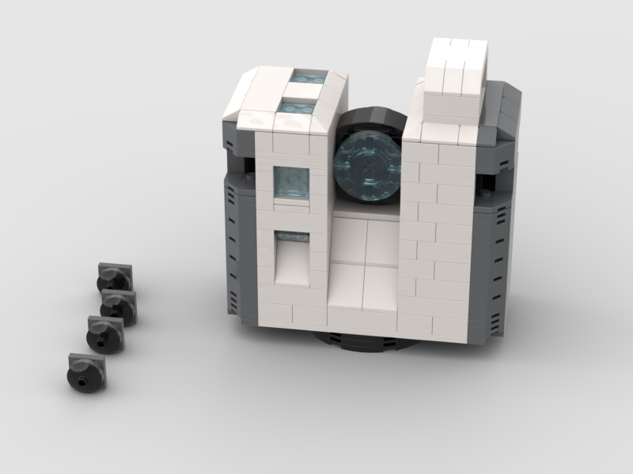

# Surveying Instruments — Brick Models

Real surveying instruments recreated in BrickLink Studio using genuine LEGO parts.

This repository contains my personal brick-built interpretations of surveying equipment, with **BrickLink Studio files**, **building instructions**, and **parts lists**.

> **Important:** I am not a professional LEGO designer. These are my first projects made with BrickLink Studio. I have **not yet built these models physically**, so the assemblies have not been validated with real bricks. Although Studio accepts the digital models, there may be stability, tolerance, collision, connection, or assembly issues that only become apparent during a real build.
>
> Some parts and/or specific colour combinations used in the models may also be **rare, expensive, discontinued, or difficult to source**. Substitutions may therefore be necessary.

Feedback, corrections, alternative parts and improved building techniques are very welcome.

## Why this project?

I kept seeing AI-generated images of surveying instruments made from LEGO bricks. They looked fun, but most were only images and did not come with an actual digital model or reproducible parts list.

So I wanted to try something different: design my own interpretations in **BrickLink Studio using genuine LEGO parts**, then share the source files, instructions and parts lists so they can potentially be built, tested and improved by the surveying and LEGO communities.

## Models

### Leica RTC700 — fan-made brick model

The first model is my independent LEGO-brick interpretation of the **Leica RTC700**.

The idea came after seeing the excellent brick-built RTC prototypes created by **Mei Yee Lai from Leica Geosystems**. Her work inspired me to create my own reconstruction in BrickLink Studio from publicly shared photos while learning Studio along the way. This model and the files provided here are my own reconstruction and are not official Leica Geosystems files.

**Files:** [model (.io)](RTC700/rtc700.io) · [building instructions (PDF)](RTC700/rtc700.pdf) · [parts list (CSV)](RTC700/rtc700.csv) · [model page](RTC700/)

### Leica TS20 — fan-made brick model

The second model is my independent LEGO-brick interpretation of the **Leica TS20 total station**, also designed while learning BrickLink Studio. This model and the files provided here are not official Leica Geosystems files.

**Files:** [model (.io)](TS20/ts20.io) · [building instructions (PDF)](TS20/ts20.pdf) · [parts list (CSV)](TS20/ts20.csv) · [model page](TS20/)

## Repository contents

Each model currently includes:

- BrickLink Studio `.io` file
- Building instructions in PDF format
- Parts list / BOM in CSV format
- Rendered image
- Dedicated README with model-specific information

## Build status

These models are currently **digital prototypes**. They have been designed in BrickLink Studio but have not yet been validated by a complete physical build.

If you decide to build one, please consider the instructions and parts lists as a starting point rather than a guarantee that every connection will work perfectly in real life. If you discover an issue or find an easier-to-source replacement for a rare part, please share it.

## Trademark and affiliation notice

This is an **independent, non-commercial fan project**. It is not affiliated with, endorsed by, sponsored by, or produced by **Leica Geosystems** or the **LEGO Group**.

The names **Leica**, **RTC700** and **TS20** are used only to identify the real surveying instruments that inspired these fan-made models. LEICA and related product names and logos are trademarks of their respective owners. LEGO is a trademark of the LEGO Group.

No official Leica or LEGO logos are used as branding for this project. The models and files are shared for hobby and educational purposes.

## Feedback

If you build one of these models, improve it, find a difficult-to-source part, or spot a bad construction choice, feel free to open an issue or share your version. I am learning BrickLink Studio as I go.
