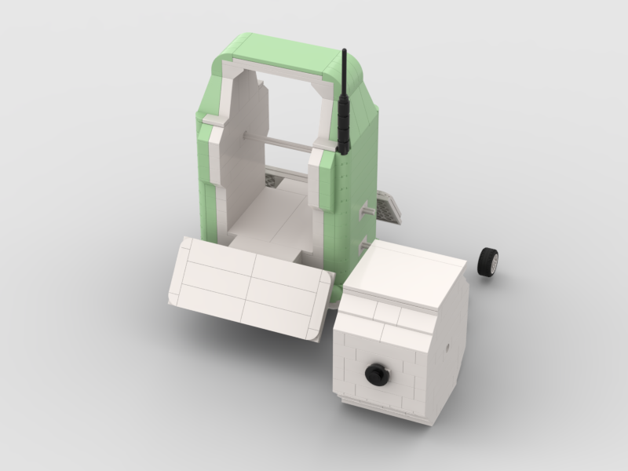

# Leica TS20 — LEGO model

This folder contains my LEGO recreation of the **Leica TS20 total station**.

This is one of my very first BrickLink Studio projects. I am not a professional LEGO designer: the aim was to reproduce the general appearance and recognisable features of the surveying instrument using real parts available in BrickLink Studio.

## Files

- [`ts20.io`](ts20.io) — BrickLink Studio model
- [`ts20.pdf`](ts20.pdf) — building instructions
- [`ts20.csv`](ts20.csv) — parts list / BOM
- [`ts20.png`](ts20.png) — rendered image

## Build status — please read

I have **not yet built this model with physical LEGO bricks**. The model and instructions were produced digitally in BrickLink Studio, so the complete real-world assembly has not been tested.

There may therefore be connections, tolerances, stability issues or assembly sequences that need to be adjusted during a physical build.

Some parts — especially certain parts in specific colours — may also be **rare, expensive, discontinued or difficult to find on BrickLink**. Equivalent parts or colour substitutions may be needed.

Because I am still learning BrickLink Studio and LEGO model design, some construction choices may be unconventional or easily improved. If you build the TS20 and discover an issue, find a better technique, or identify an easier-to-source replacement part, contributions and suggestions are very welcome.

## Disclaimer

Independent, non-commercial fan project. Not affiliated with or endorsed by Leica Geosystems or the LEGO Group.
